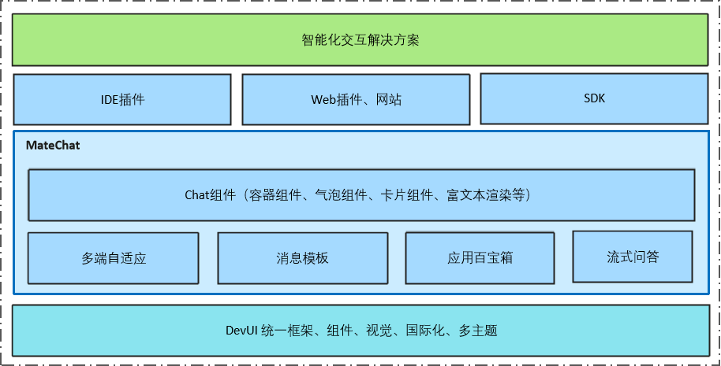
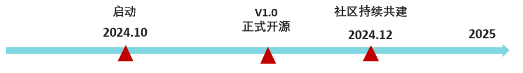

<h1 align="center">MateChat</h1>

面向智能化辅助场景的前端解决方案，助力智能化场景的搭建。

简体中文 | [English](./README_en_US.md)

## 🌈 特性预告
* ⚡ **开箱即用的解决方案**：一站式智能对话解决方案内置对话逻辑及常用模板，支持自由定制与二次开发
* 📦 **组件丰富，功能全面**：基于DevUI基础组件，提供了 50+ 基础组件，覆盖各类场景，组件特性丰富，满足各种功能需求，简单搭建各种业务模板
* 🌟 **丰富的卡片模板**：列表类卡片，总览类卡片，代码展示类卡片
* 🎨 **支持主题定制**：并内置 无线/深邃夜空/追光/ide-light/ide-dark 5种主题，可搭配 DevUI 主题获得更好的使用体验
* 🌍 **支持国际化**：支持多语言，便捷配置国际化
* 📱  **支持响应式**：自适应不同屏幕尺寸

## 📅 特性规划 & 开源计划

## 🤝 欢迎贡献
如果你对本项目感兴趣，欢迎关注我们的进展、提出宝贵的建议，参与到 MateChat 项目的建设中来，共同打造这个令人期待的项目！

## License
[MIT](https://gitcode.com/DevCloudFE/MateChat/blob/main/LICENSE)

## 联系方式
欢迎加入我们的开源社区，关注DevUI微信公众号：DevUI

