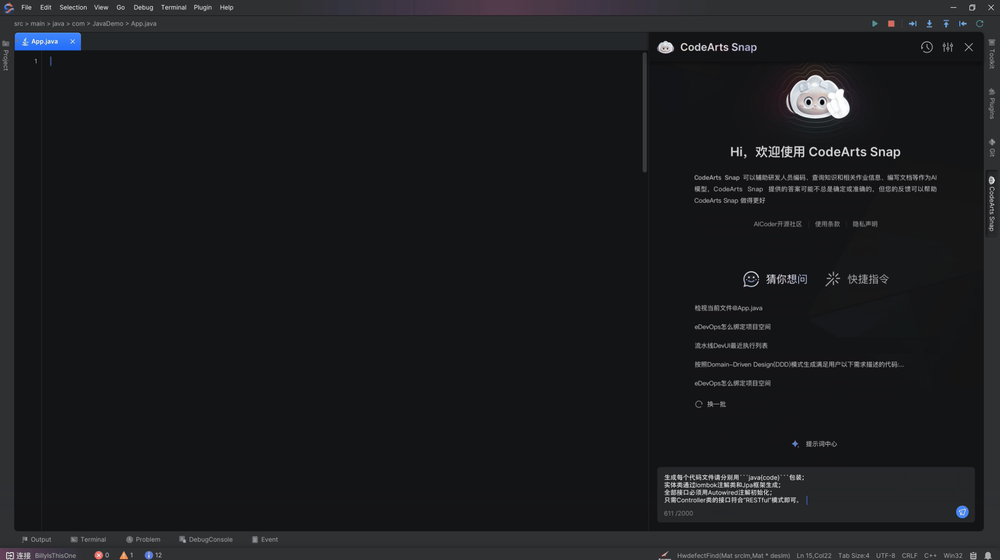
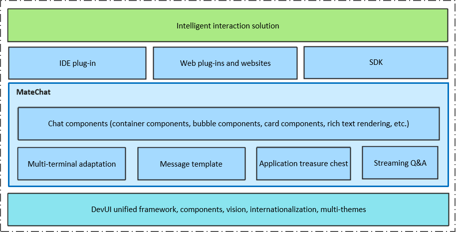
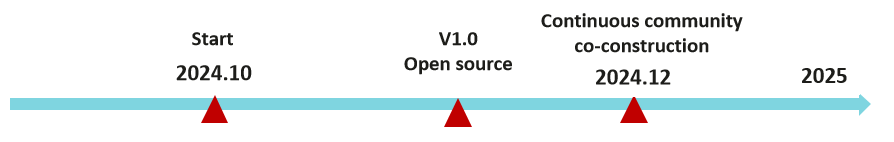
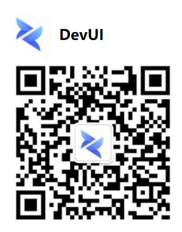

<h1 align="center">MateChat</h1>

Front-end solution for intelligent assistance scenarios, helping to build intelligent scenarios.

[简体中文](./README.md) | English

## 🌈 Feature Preview
* ⚡ **Out-of-the-box solution**: A one-stop intelligent conversation solution with built-in conversation logic and common templates, supporting free customization and secondary development.
* 📦 **Rich components and comprehensive functions**: Based on DevUI basic components, it provides more than 50 basic components, covering various scenarios. The components have rich features and meet various functional requirements, making it easy to build various business templates.
* 🌟 **Rich card templates**: List-type cards, overview cards, and code display cards.
* 🎨 **Support theme customization**: It has five built-in themes (wireless/deep night sky/chasing light/ide-light/ide-dark), and can be combined with DevUI themes for a better user experience.
* 🌍 **Support internationalization**: Support multiple languages and convenient configuration of internationalization.
* 📱  **Support responsive design**: Adapt to different screen sizes.

## 📅 Feature Planning

## 🤝 Welcome to Contribute
If you are interested in this project, welcome to follow our progress, put forward valuable suggestions, and participate in the construction of the MateChat project to jointly create this exciting project!

## License
[MIT](https://gitcode.com/DevCloudFE/MateChat/blob/main/LICENSE)

## Contact Us
Welcome to join our open source community, follow the DevUI WeChat official account: DevUI.

